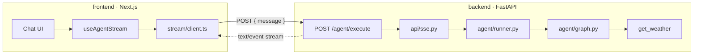
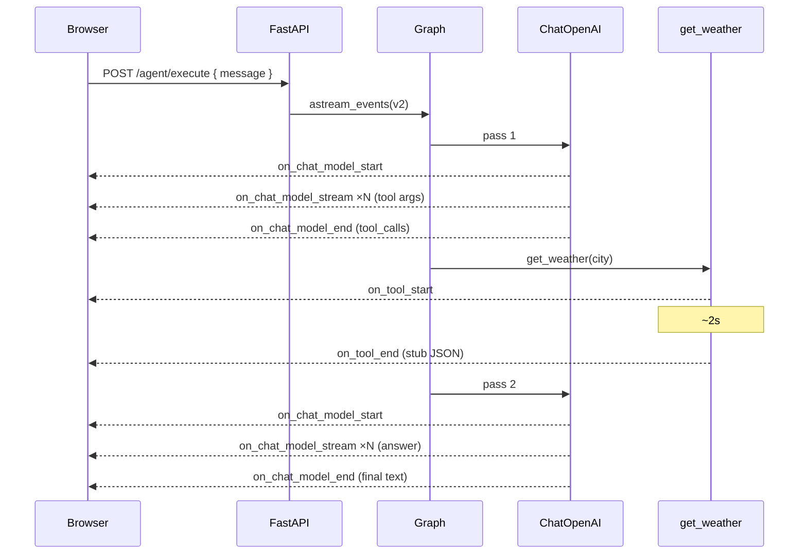
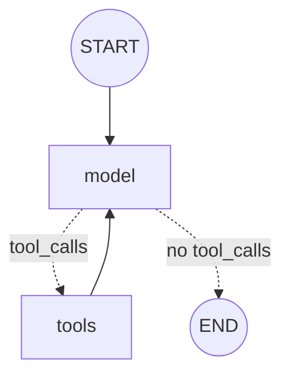

# Weather Agent

A LangGraph agent with a single weather tool, streamed to a chat UI over
Server-Sent Events. The model decides whether to call `get_weather`, the graph
executes it, and every step reaches the browser as a raw `astream_events` v2
`StreamEvent` — rendered as it arrives.



## Demo

[▶ Watch the demo](docs/demo.mp4) — a weather question streaming through the
tool call, the stub result, and the final answer.

## Layout

```
backend/   FastAPI + LangGraph   (Python 3.12, uv)
frontend/  Next.js + Tailwind    (pnpm)
```

Each side owns its own environment file: `backend/.env` and
`frontend/.env.local`. Both are gitignored; `.env.example` files document the
expected keys.

## Running

### Backend

```bash
cd backend
cp .env.example .env          # set OPENAI_API_KEY
uv sync
uv run uvicorn app.main:app --reload
```

API on `http://localhost:8000` — OpenAPI docs at `/docs`.

### Frontend

```bash
cd frontend
cp .env.example .env.local    # NEXT_PUBLIC_API_URL=http://localhost:8000
pnpm install
pnpm dev
```

Chat on `http://localhost:3000`.

## Smoke test

With both running, ask **"Qual o clima em São Paulo?"**. The assistant turn
should render, in order: the tool call, the stub JSON, and a sentence
mentioning 22°C.

Against the API directly:

```bash
curl -N -X POST http://localhost:8000/agent/execute \
  -H "Content-Type: application/json" \
  -d '{"message": "Qual o clima em São Paulo?"}'
```

`-N` disables curl's output buffering; without it the stream appears all at
once at the end.

## How a request flows



The model runs twice per weather question. Each run has its own `run_id`,
which is how the front-end knows which draft a given `on_chat_model_end`
replaces.

## Graph



Solid edges are fixed; dotted edges are the conditional branch decided by
`should_continue` on the last message's `tool_calls`. State is
`MessagesState` with the `add_messages` reducer; `model` is `ChatOpenAI` bound
to the tool, `tools` is a prebuilt `ToolNode`.

## Where each acceptance criterion lives

| AC | Location |
|---|---|
| 01 · `POST /agent/execute` | `backend/src/app/api/routes.py` — composes `sse_stream(execute(...))` and returns it; never iterates, never imports LangGraph |
| 02 · Agent runs the graph | `backend/src/app/agent/runner.py` — compiles once, calls `astream_events`, yields events |
| 03 · Graph + tool | `backend/src/app/agent/graph.py` (`model` and `tools` nodes, conditional edge) and `tools.py` (`get_weather`: 2s sleep, fixed stub) |
| 04 · `astream_events` v2 | `runner.py` — `version="v2"`, `include_types=["chat_model", "tool"]` |
| 05 · SSE `event` + `data` | `backend/src/app/api/sse.py` — `data` is the whole StreamEvent, serialized |
| 06 · Type → renderer | `frontend/src/lib/stream/events.ts` (`toStreamEvent` throws on unknown types) and `components/chat/AssistantMessage.tsx` (`renderPart`, exhaustive switch) |
| 07 · Concatenate, then end | `frontend/src/lib/conversation/reducer.ts` — `stream` appends, `end` replaces the draft with `output`, each `kind` is a separate state on screen |
| 08 · Smoke test | section above |
| 09 · Secret | `backend/.env`, gitignored; validated at boot by `settings.py` |

## Design notes

- **`data` carries the full StreamEvent** (AC-05). Every token ships with
  ~1.5 KB of repeated metadata. In production the SSE layer (`sse.py`) would
  project only the fields the client reads; the agent would keep emitting the
  complete event.
- **`.env` lives in `backend/`**, not at the repository root. AC-09 says
  "root"; here that is read as the root of the Python project, since the
  variables belong to it. The front-end has its own `.env.local`.
- **Two processes, CORS between them.** The API allows only
  `http://localhost:3000` and only `POST`. No proxy in front of the stream —
  proxies tend to buffer SSE.
- **The model node calls `ainvoke`, not `astream`.** `astream_events` attaches
  a streaming callback handler; `BaseChatModel._should_stream` detects it and
  streams internally, so token events arrive without the node knowing.
- **No `EventSource`.** The native API only supports `GET`. The parser in
  `frontend/src/lib/stream/sse.ts` reads the `fetch` body, buffers on `\n\n`,
  and decodes with `TextDecoder` in stream mode so multibyte characters split
  across chunks (`ã`, `°`) survive.
- **Tool calls are read from `on_chat_model_end`, never from chunks.** During
  streaming the arguments arrive as JSON fragments; only the end event carries
  the parsed object.

## Out of scope

Auth, persistence, checkpoints, RAG, AG-UI, custom stream modes, real weather
HTTP.
